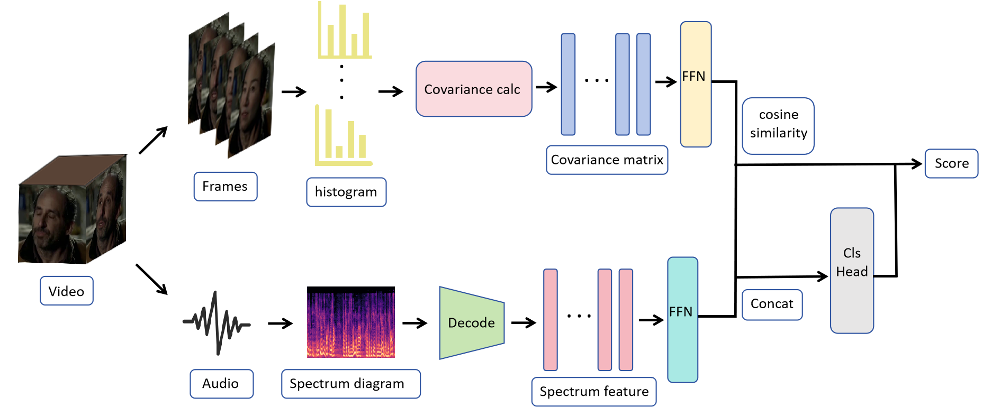
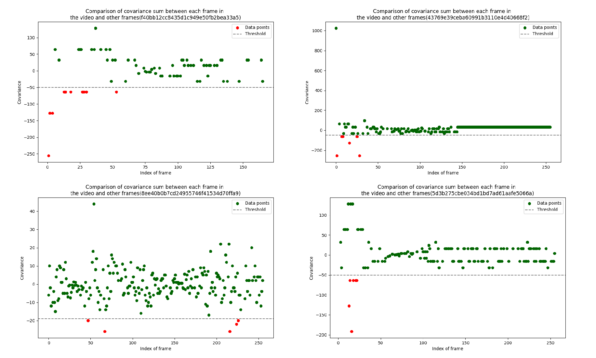

# multi-ffdv
This is the competition for Track 2: Deepfake Audio-Video Detection in the Inclusion・The Global Multimedia Deepfake Detection Challenge. For specific details, please refer to https://www.kaggle.com/competitions/multi-ffdv

## Technical report

The technical report has been placed in [despairingjuvenile_tech_report_template.pdf](./despairingjuvenile_tech_report_template.pdf)

The method structure is as follows:




Visualization of covariance between different frames in individual forgery examples:



## Environment

```
conda create --name multi-ffdv python=3.8
conda activate multi-ffdv
```

> Install requirements (maybe some package need to install manually)：

```
pip install -r requirements.txt
```

## Dataset structure

```bash
path/to/project
├── cfg/
├── checkpoint/
├── data/
│   ├── trainset/
│   │   ├── 1f8702f426f383c4199da33c53cfb74c.mp4
│   │   ├── 4cd64f2ab88bf95ed20627246cbdc4bb.mp4
│   │   └── ...
│   ├── valset/
│   │   ├── 8ee40b0b7cd24955746f41534d70ffa9.mp4
│   │   ├── 74c6701a7e57a84bf18080facc555933.mp4
│   │   └── ...
│   ├── testset/
│   │   ├── 65029d8e5968f97213e57cd075438127.mp4
│   │   ├── 64364239a833c9d926e08d6b91742f9b.mp4
│   │   └── ...
│   ├── trainset_label.txt
│   ├── valset_label.txt
│   └── testset_label.txt/
└── ...
```

## Feature extraction

> Before training, it is necessary to extract features first:

```
python utils/extract_ffdv.py
```

> After extraction, the data structure directory is as follows:
>
> If you want to quickly obtain extracted features, you can visit the following link to obtain them:
>
> https://pan.quark.cn/s/31534451a326

```bash
path/to/project
├── cfg/
├── checkpoint/
├── data/
│   ├── trainset/
│   │   ├── 1f8702f426f383c4199da33c53cfb74c.mp4
│   │   ├── 4cd64f2ab88bf95ed20627246cbdc4bb.mp4
│   │   └── ...
│   ├── valset/
│   │   ├── 8ee40b0b7cd24955746f41534d70ffa9.mp4
│   │   ├── 74c6701a7e57a84bf18080facc555933.mp4
│   │   └── ...
│   ├── testset/
│   │   ├── 65029d8e5968f97213e57cd075438127.mp4
│   │   ├── 64364239a833c9d926e08d6b91742f9b.mp4
│   │   └── ...
│   ├── trainset_label.txt
│   ├── valset_label.txt
│   └── testset_label.txt/
│   ├── trainset_raw/
│   │   ├── audio_feature
│   │   │	├── 1f8702f426f383c4199da33c53cfb74c.mp4.jpg
│   │   │	├── 4cd64f2ab88bf95ed20627246cbdc4bb.mp4.jpg
│   │   │	└── ...
│   │   ├── video_feature
│   │   │	├── 1f8702f426f383c4199da33c53cfb74c.mp4.npy
│   │   │	├── 4cd64f2ab88bf95ed20627246cbdc4bb.mp4.npy
│   │   │	└── ...
│   │   ├── wav_file
│   │   │	├── 1f8702f426f383c4199da33c53cfb74c.wav
│   │   │	├── 4cd64f2ab88bf95ed20627246cbdc4bb.wav
│   │   │	└── ...
│   ├── valset_raw/
│   │   ├── audio_feature
│   │   │	├── 8ee40b0b7cd24955746f41534d70ffa9.mp4.jpg
│   │   │	├── 74c6701a7e57a84bf18080facc555933.mp4.jpg
│   │   │	└── ...
│   │   ├── video_feature
│   │   │	├── 8ee40b0b7cd24955746f41534d70ffa9.mp4.npy
│   │   │	├── 74c6701a7e57a84bf18080facc555933.mp4.npy
│   │   │	└── ...
│   │   ├── wav_file
│   │   │	├── 8ee40b0b7cd24955746f41534d70ffa9.wav
│   │   │	├── 74c6701a7e57a84bf18080facc555933.wav
│   │   │	└── ...
│   ├── valset_raw/
│   │   ├── audio_feature
│   │   │	├── 65029d8e5968f97213e57cd075438127.mp4.jpg
│   │   │	├── 64364239a833c9d926e08d6b91742f9b.mp4.jpg
│   │   │	└── ...
│   │   ├── video_feature
│   │   │	├── 65029d8e5968f97213e57cd075438127.mp4.npy
│   │   │	├── 64364239a833c9d926e08d6b91742f9b.mp4.npy
│   │   │	└── ...
│   │   ├── wav_file
│   │   │	├── 65029d8e5968f97213e57cd075438127.wav
│   │   │	├── 64364239a833c9d926e08d6b91742f9b.wav
│   │   │	└── ...
└── ...
```

> If you have other ground truth files, you can modify them in cfg.yml by simply changing the file name in cfg.yml and placing the corresponding ground truth file in the /data directory:

```
label_name:
  # trainset: trainset_label.txt
  # for example:
  trainset: my_label.txt
  valset: valset_label.txt
  testset: testset_label.csv
evaluate: val
extract_path: /hy-tmp/multi-ffdv/data
```

> After extracting the features, you can train directly:

```
python main.py
```

If you want to train directly without extracting features, you can modify lines 4 and 5 of main.py (by using the submit_dataset.py file, but this may increase the training time):

```
import os
import torch
import logging
# from dataset.ffdv_dataset import FFDV_Dataset
from dataset.submit_dataset import FFDV_Dataset
```

If you want to only evaluate the model, you can first choose to use either valset or testset in the evaluate section of the cfg.yml file:

```
label_name:
  trainset: trainset_label.txt
  valset: valset_label.txt
  testset: testset_label.csv
# if want to use testset to eval, change the evaluate to testset
# evaluate: test
evaluate: val
extract_path: /hy-tmp/multi-ffdv/data
```

 and then run the following command:

```
python main.py --checkpoint /your/checkpoint/path
```

Then you can check the evaluate results in prediction.txt.csv file. 

If you only want to inference about a single video file, run the following command:

```
python inference.py --video_path /your/video/path
```

Or if you want to inference all the videos in the video folder, run the following command:

```
python inference.py --video_dir /your/video_dir/path
```


 ## Contact
If any questions, please contact me:  565027448@qq.com
